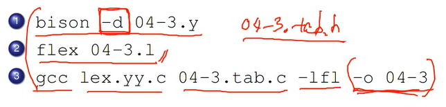

# RESUME test ( Hyejin KIM )

## 개인 이력사항 ( sub title )

#### 이름 : 김혜진
#### e-mail : un123k@naver.com
#### university : hallym university

> 취미 
>> 만화 보기  
>> 맛있는 거 먹기  

## 사용 언어
1. Java
2. C
3. Python

## 최근 관심 분야
* 오픈소스
* 딥러닝
* 앱 개발
* 웹 개발
*****************
* 아이패드
* 아이폰
*****
## 오픈소스 커뮤니티 정리파일
[오픈소스 커뮤니티 파일](openSourceCommunity.md)  
*****
* www.google.com  
* [Google](https://www.google.com)  
******************

### 관심있는 사이트 목록
[한림대학교][hallym]  

### 주요 검색 사이트
[구글][google]  
[네이버][naver]  

### 마크언어 문법 강조
기본문구  
*강조 문구*  
_강조 문구_  
**강조 문구**  
__강조 문구__  
++강조 문구++  
~~강조 문구~~  

### 표 만들기
|학년|언어|개발도구|
|-|-|-|
|1|[자바](http://www.oracle.com)|[이클립스][eclipse]|
|2|C|비주얼스튜디오|
|3|C++|비주얼스튜디오|  

|제목|제목|제목|
|:--|--:|:--:|
|왼쪽정렬|오른쪽정렬|중앙정렬|  

|제목|제목|제목|
|:--|--:|:--:|
||중앙 확장||
|왼쪽 확장|||
|||오른쪽 확장|

### 이미지 삽입하기
  

[eclipse]: http://www.eclipse.org
[google]: https://www.google.com  
[naver]: http://www.naver.com  
[hallym]: http://www.hallym.ac.kr
